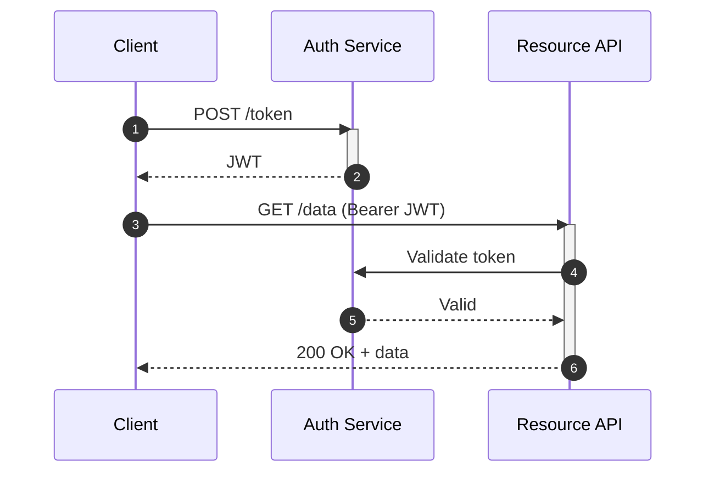

# Visualize

Turn conversation context into something the user can see, not more text to parse. Visual learners struggle with markdown walls — a well-chosen diagram communicates in seconds what paragraphs can't.

## When NOT to visualize

A bad diagram is worse than good prose. Before making anything, ask: does the content have enough structure, relationships, or complexity that a visual genuinely clarifies it? If the answer is no, just write the answer.

Skip the diagram when:
- The content fits in 2–3 clear sentences
- It's a simple yes/no, a definition, or a single-step fact
- The user asked a direct question that deserves a direct answer, not a detour through a chart
- Making a diagram would require inventing structure that isn't really there

Visualizing things that don't need it adds noise and delays the answer. The goal is clarity, not visual output for its own sake.

## What to visualize

Read the current conversation. Pick the most recently discussed or most conceptually dense thing that would benefit from a visual. If nothing is obvious, ask one targeted question ("What's most confusing — the data flow, the component relationships, or the tradeoffs?") — but usually context is enough, so just make a call.

## Format selection

| Content type | Format |
|---|---|
| Request/response or API interaction flow | Mermaid sequence diagram |
| Process steps, decision tree | Mermaid flowchart |
| State machine | Mermaid state diagram |
| Data model / entity relationships | Mermaid ER diagram |
| Comparing 2–3 approaches or options | HTML side-by-side layout |
| System architecture (≤ 8 components) | Mermaid graph |
| System architecture (complex, layered) | HTML with annotated layout |
| Concept with nuance or teaching value | HTML with callouts/annotations |
| Timeline or phases | Mermaid gantt or HTML timeline |
| Interactive / explorable | HTML + JavaScript |

When in doubt between Mermaid and HTML: Mermaid is faster and renders natively in markdown. Use HTML when you need custom layout, side-by-side comparisons, meaningful color coding, or when the Mermaid diagram would be too dense to read.

**Never use ASCII art diagrams.** If the content warrants a diagram, use Mermaid — it renders cleanly in any markdown viewer and is more maintainable. ASCII diagrams look clever but are harder to read and impossible to edit cleanly. The only exception is a very simple inline illustration (e.g., a 3-box stack) where a full Mermaid block would be disproportionate to the surrounding text.

## Mermaid diagrams

Output in a fenced `mermaid` code block. Keep node labels short (3–5 words). Use subgraphs to group related components. Add edge labels when relationship type or direction isn't obvious from the structure.

For sequence diagrams, use `autonumber` when there are more than 4 steps. Use `activate`/`deactivate` for async or long-running operations.

## HTML artifacts

Write a single self-contained `.html` file. Key rules:
- **No external dependencies** — inline all CSS and JS. Must work offline.
- **Communicate, don't decorate** — use color to encode meaning (status, comparison side, category), not as decoration. Neutral backgrounds, system font stack, generous whitespace.
- **Keep it short** — a 600-line HTML file is just another wall. Conceptual clarity beats feature completeness.
- Save to `/tmp/visualize_<topic>.html` and open with `open /tmp/visualize_<topic>.html`.

**Common HTML patterns:**

*Side-by-side comparison* — two columns with a shared attribute list on the left or as row headers. Color-code the "winner" per row if there's a meaningful distinction.

*Annotated architecture* — layered boxes (e.g., frontend / API / data layer) with labeled arrows. Add callout bubbles for the non-obvious design decisions.

*Concept explainer* — a numbered visual walkthrough with brief captions per step. Essentially a storyboard: each panel is one idea.

*Decision matrix* — rows are options, columns are criteria. Color cells green/yellow/red. Works better than a markdown table when there are 3+ options or the criteria need explanation.

## Communication style

One sentence before the artifact — name what you're making and why this format. Then produce it. No asking for permission unless topic is genuinely ambiguous.

**Good:**
> "Here's the auth flow as a sequence diagram — easier to see who calls whom."
> `[mermaid block]`

**Good:**
> "Comparing these as a visual side-by-side — the tradeoffs are easier to scan than bullets."
> `[opens HTML]`

**Too much:**
> "I'll create a diagram to visualize the flow you described. The diagram will show the steps in the process and how they connect. Let me know if you'd like a different format or style. Here it is: ..."

After producing the artifact: don't summarize what you drew. If there's a meaningful simplification (e.g., "this omits the retry logic for clarity"), one sentence is enough. Let the visual do the work.
